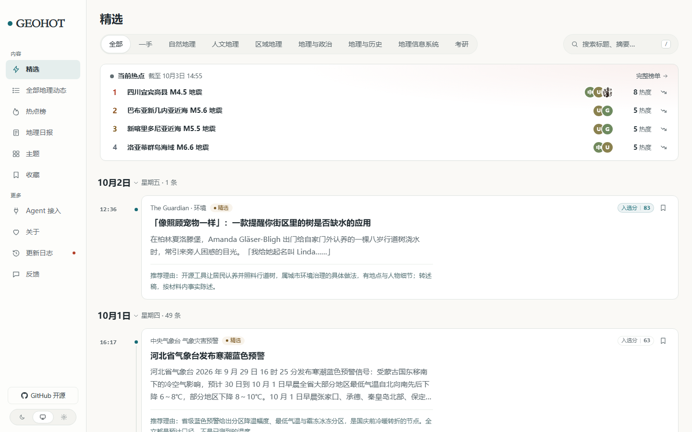
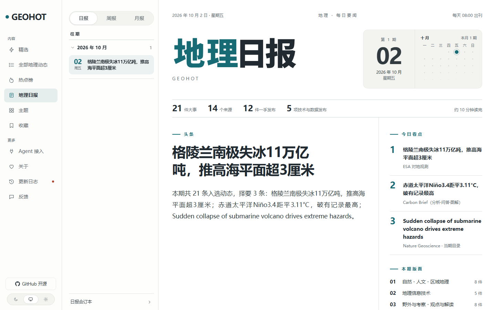

<sub>🌐 <a href="README.md">中文</a> · <b>English</b> · The full manual is in Chinese: <a href="docs/manual.md">docs/manual.md</a></sub>

<sub>This page is a translation of <a href="README.md">README.md</a>, kept in step by hand. Where the two disagree, or where either disagrees with the code, the code wins — and the Chinese page is usually the one that was corrected first.</sub>

<div align="center">


<p><sub>GEOGRAPHY · HOTSPOT · DAILY &nbsp;—&nbsp; filtered by spatial significance · every item keeps its original link · no predictions</sub></p>

# GEOHOT · 地理热点

> *"News about this land arrives every day. Only a few items come with evidence — and deserve to be written up."*

[](https://xxc2007.me/geohot/)
[](LICENSE)
[](NOTICE)
[](#iii--stack)
[](#1--taxonomy-seven-categories-one-rule)
[](#4--state-where-it-stands-and-its-edges)
[](#3--brain-the-editorial-brain-people-set-the-standard-the-model-answers-each-item--and-the-terms-say-so)
[](https://github.com/xxc2007)

<br>

**It reads the whole geography beat every day and keeps only the few items that are documented and worth writing about.**

<br>

It watches stations, satellite agencies, statistics and administrative-division offices, journals and researchers, filters by **spatial significance** down to a handful of items, writes Chinese headlines and summaries, merges reports about the same event into one story, and prints a daily paper at 08:00 (Asia/Shanghai) every morning. Free, no sign-up, and every item keeps its original link.

It is built on the open-source [AIHOT](https://github.com/KKKKhazix/AIHOT) framework (MIT), with the industry layer swapped for geography: the engine lives in `apps/` and `packages/`, and everything geography-specific — site name, categories, topics, sources, scoring standard, thresholds, brand, terms pages — lives in one folder: [`industry/`](industry/).

<br>

<!-- This badge row is a reader's entry point, not a second source of truth: the formulas, the re-check
     command and "which number belongs to which release" all live in the 4 · STATE table below.
     Change that table and change these badges in the same commit. -->

<p><b>At a glance</b></p>

[](#4--state-where-it-stands-and-its-edges)
[](#4--state-where-it-stands-and-its-edges)
[](#4--state-where-it-stands-and-its-edges)
[](#4--state-where-it-stands-and-its-edges)
[](#4--state-where-it-stands-and-its-edges)
[](#4--state-where-it-stands-and-its-edges)

<sub>Recomputed from the local development database, midday 2026-10-06 · production is a different set of numbers that changes daily (`/api/site/stats` returns all of them at once)</sub>

<br>

[I Highlights](#i--highlights) · [II Site map](#ii--site-map) · [III Stack](#iii--stack) · [IV Reuse it for your field](#iv--reuse-it-for-your-field) · [V Run it locally](#v--run-it-locally) · [VI Design notes](#vi--design-notes) · [VII License](#vii--license-and-provenance) · [VIII Star history](#viii--star-history) · [Full manual (Chinese)](docs/manual.md)

<br>

> This page is the introduction. The **operating manual** (how to run it locally, the port table, the check commands, the known limits, the pre-launch checklist) lives in [`docs/manual.md`](docs/manual.md) — that file is this tree's original README, moved over with nothing deleted. For day-to-day operation read [`docs/geohot-runbook.md`](docs/geohot-runbook.md); for selection and calibration read [`docs/selection.md`](docs/selection.md); to swap in your own field read [`docs/customize.md`](docs/customize.md); for how sources are configured read [`docs/sources.md`](docs/sources.md); for deployment read [`docs/deploy.md`](docs/deploy.md); **to change the domain or the server** read [`docs/migration.md`](docs/migration.md); for processes and directories read [`docs/architecture.md`](docs/architecture.md). Of that list only `README.md`, `docs/manual.md`, `docs/geohot-runbook.md`, `docs/migration.md` and `docs/known-issues.md` (the running, round-by-round to-do list this page cites several times) were written for this site; the rest (`customize/selection/sources/architecture/leaderboard/deploy`) are still the upstream reference docs, and a number of their commands and figures do not hold here — **which documents to discount, and by how much, item by item, is the "document × status" table in [section 9 of `docs/manual.md`](docs/manual.md)** (that table is this repository's anti-rot device: it records, document by document, which statements no longer hold and which are merely transcribed).

</div>

---

<p align="center">
  
</p>

<details>
<summary>▲ Plate 1 · HOME, the "Selected" feed · shot 2026-10-04 22:08 (+0800) · expand for what is in this frame, and why you might be looking at a different line instead</summary>

Shot on **2026-10-04 22:08 (+0800)**, route `/geohot/`, viewport 1440×900, light theme · The block at the top is **Current hotspots**: four events ranked by heat, each row showing rank, headline, avatars of the sources discussing it (selected group, at most three plus +N), the heat value and a trend arrow, with "Full list" in the top right going to `/hot`. Next to the headline it says **as of 3 October 14:55** — this particular board is not from this hour. The board is recomputed every five minutes, and a round that comes out empty no longer wipes the home page: `packages/backend/src/events/hot.ts` only publishes a board when there are events, so the read side in `packages/backend/src/events/hot-read.ts` falls back to the most recent board that had events (up to 24 hours old), dropping entries whose events have since been merged elsewhere and re-ranking the rest. When the board is under two hours old there is no timestamp here, just a pulsing red dot. **If the home page shows a different line instead** — "No event in the past 48 hours has been discussed by more than one source", with a link to `/all` — that is not a failure: the board has aged past a day and the page is telling the truth. The trade-off between those two states is documented in the comment at the top of `apps/web/app/features/feed/HotTopics.tsx`. The sidebar has **no** "Boards" entry: that whole layer was deleted on 2026-10-04 at the owner's request, and `/geohot/boards` now returns 404. The timeline shows 1 item for 2 October and 49 for 1 October; the first is The Guardian · Environment's "Like looking after a pet: the app that tells you when your street trees are thirsty", selection score 83. The filter bar has **eight slots**: `All` plus **the seven categories**, ending with "GIS" and "Postgraduate exams" — on 2026-10-03 those two swapped places and "Fieldwork & expeditions" and "Opinion & analysis" were deleted; on the evening of 2026-10-04 the `First-party` slot was removed too (it was a channel alias for the `first_party` data field and did the same job as the "All + category" row; the `first_party` field itself is still used in scoring, in the daily paper's "N first-party disclosures" and in the event page's "official first-party"). (An earlier version of this caption attributed "no hotspot row in the frame" to "the hot board is empty"; the real cause was the old code hiding the whole block when the board had fewer than three entries — the attribution was wrong, and the mistake stays in `docs/known-issues.md` rather than being erased.) **This screen changes daily; the live site is the source of truth**: `https://xxc2007.me/geohot/`.

</details>

---

## I · HIGHLIGHTS

### 1 · TAXONOMY Seven categories, one rule

The categories are this site's skeleton (`industry/taxonomy.ts`; the `key` goes straight into the URL and is frozen once live):

| key | Category | What it takes |
|---|---|---|
| `physical` | Physical geography | Landforms, climate, hydrology, soils, vegetation and hazards — must come with observations, maps or imagery |
| `human` | Human geography | Population and migration, urbanisation, industry and transport location, administrative boundary changes, urban–rural and regional policy |
| `regional` | Regional geography | Whole-region or whole-basin change: polar regions, the Qinghai–Tibet Plateau, deltas, city clusters, transboundary rivers |
| `geopolitics` | Geography and politics | Sovereignty, boundaries and territorial disputes, geopolitical structure, strategic corridors, transboundary rivers and maritime rights |
| `histgeo` | Geography and history | Geographic change over historical time and past-versus-present readings: river courses and coastlines, administrative and territorial evolution, the rise and fall of cities, old maps |
| `geotech` | GIS | Remote sensing and imagery, navigation and positioning, observation datasets and standards, plus GIS software and platforms, spatial databases and standards, WebGIS and 3D engines, open-source ecosystems and licence changes |
| `geoedu` | Postgraduate exams | Admissions policy and programme catalogues for geography, disciplines and degree programmes, exam syllabi and cut-off scores, admissions data |

> Both changes came in one day, 2026-10-03, after the owner looked at the home-page filter bar. **First, a merge**: "Geographic information technology" and "Geographic information systems" became one area, named "GIS", keeping the category `key` `geotech` — it was already in URLs and in the database, and the head of the vocabulary file says the key cannot change once live; the other key, `gis`, lived a few hours and its rows were merged into `geotech` by migration `0040`. **Then, two deletions**: `fieldwork` (Fieldwork & expeditions) and `comment` (Opinion & analysis) were **removed outright** — not renamed, not hidden: the filter bar, card badges, daily-paper sections, per-category RSS feeds, the enumerations in the public API and MCP, and the category list inside the prompts all went with them. The rows under those two keys (21 in production, 8 of them selected) were reassigned item by item to the five surviving academic categories by migration `0041`; the `selectbench_results` benchmark table was **left alone** — it is an archive of what previous models answered, and rewriting it would be forging a record.
>
> The two deleted categories used to share the daily paper's third section, "Practice". **The fallback section moved from there to "Uncategorised"**: an item with no category that reaches the paper lands in the `DEFAULT_SECTION` section, an explicit constant at `packages/backend/src/reports/compose.ts:26` (`:28` builds `REPORT_SECTIONS = [...SECTION_ORDER, DEFAULT_SECTION]`), not "the last entry of the category array" — the earlier version derived it from the array's tail, so deleting one category would have moved every uncategorised item on the site into some other section. That invariant is pinned by two tests, `tests/report-default-section.test.ts` and `tests/exit-category-parity.test.ts`.

**There is no separate "Boards" page.** That layer did exist: four cross-category direction pages shipped on 2026-10-03 (`/boards`: GIS / Postgraduate exams / Geography & politics / Geography & history, in the same order as the filter bar) and were **deleted whole on 2026-10-04 at the owner's request** — looking at that page he said "this boards feature is a bit redundant", since it collected items by discipline and purpose (its copy said "today" while it applied no time window at all, just the most recent items in reverse chronological order) and the topic pages plus the filter bar's categories were already doing that job. `/boards` and `/boards/<slug>` are both 404 now. The four directions **did not lose their entry points**: they were the four categories in the home filter bar all along (`/all?category=geotech` / `geoedu` / `geopolitics` / `histgeo`), unselected source items remain listed in "All updates", and the topic pages (`/topics`) still thread a single story through regions, institutions and fields. **Only the view was deleted** — items, the `category` field, the category vocabulary and the public thresholds were not touched, and the 54 `defaultCategory` entries in `industry/sources.json` still sort items into their categories.

**There is one selection rule: spatial significance first** — large scale of impact, independent coverage from multiple parties, and supporting data, maps or imagery; all three must hold for an item to rank near the top. That rule is written into the scoring prompt, into the five-axis weight table, and into the heat algorithm ("multiple independent reports = heat").

**Noise we explicitly suppress**: travel advertorials, study-tour and camp recruitment, teaching-training and courseware sales, scenic-area press releases; and beyond those, unsupported general regional introductions, unverified geographic rumour, pure government notices and meeting minutes, and multi-subject round-ups. These are `BLOCK`ed at the **prefilter** stage and never reach scoring.

### 2 · PIPELINE Seven steps from raw item to front page

**Collect → prefilter → two independent scores → threshold → merge into events → heat → the paper**

- **Prefilter** (`industry/prompts/prefilter.md`): is this geography, and does it carry real information? Anything `BLOCK`ed never appears on any public page.
- **Two independent scores**: the same scoring standard is called twice in series (0–100), and an item is selected only if **the sum of the two ≥ 2 × threshold**; cards show the mean of the two, rounded down.
- **Thresholds by source tier**: `T1` 56 / `T1_5` 59 / `T2` 62 (selection lines at sums of 112 / 118 / 124), plus an `understandFloor` of 46 — items below selection but above that line still get a Chinese headline and summary written in the selected style. The live values live only in [`industry/selection.ts`](industry/selection.ts); that file's header comment *is* their derivation, and it also states that **these numbers were reasoned out and have not yet been calibrated against a gold set**.
- **Merge into events**: several reports of the same event become one story with a digest on its page; selected items wait for grouping to finish before appearing in the feed, so the same event does not surface as several separate cards first.
- **Heat**: a 48-hour window, a 24-hour half-life, one vote per independent source, at least two participants and at least one of them an editorial source.
- **Issues**: daily at 08:00, weekly on Monday 10:00, monthly on the 1st at 10:30; items are ranked by heat and the paper has discipline and technology sections (the "Practice" section was removed on 2026-10-03 — see the category note above).

### 3 · BRAIN The editorial brain: people set the standard, the model answers each item — and the terms say so

**Production runs a real model**: since 2026-10-06 this site calls a third-party model service (Agnes AI's `agnes-3.0-flash`, an OpenAI-compatible endpoint), which performs the prefilter, the two independent scores, the Chinese headlines and summaries, and the event merging. The framework reads `LLM_BASE_URL / LLM_API_KEY / LLM_MODEL` only at the moment it actually calls a model, so switching providers means editing those three `.env` lines and no code at all; `MODEL_CALLS_ENABLED` is the master switch, and every paid call goes through the receipt table and per-minute / per-hour / per-day budget breakers (currently 40 / 1500 / 12000; when a window trips, calls pause rather than blowing up overnight).

- **The standard is still set by people**: the category table, the significance rule (spatial significance), the noise list, the threshold scores and the prompts all live in `industry/` and were confirmed item by item by the owner; the model produces a per-item answer against that standard, the owner spot-checks and overrides in the admin panel (`editorial_overrides`), and readers can report errors through Feedback.
- The gates are real: prefilter, two independent scores, thresholds, the three-valued grouping relation, the 48-hour history gate, daily-paper sections and the public read layer **all run through the actual code, with nothing bypassed**.
- **Local development and CI cost nothing and send nothing out**: the repo keeps a stub listening on 127.0.0.1 only ([`tooling/brain-stub.ts`](tooling/brain-stub.ts)), which replays hand-written judgements from `tooling/fixtures/*.jsonl` keyed by which step an item is in and which item it is; material with no fixture falls back to deterministic defaults (score 20, sum 40, below every tier's 2× line). The test suite never touches any external service, and this layer is why.
- Chinese first-party sources have one fallback: when the model returns no Chinese summary, the summary falls back to **the opening of the source's own passage** (the same length threshold applied in one place, not a rewrite; English material gets nothing at all). That came out of the 2026-10-05 "the whole site went quiet" incident — an anti-fabrication gate with no copy to replay will hold back even items that were Chinese to begin with.
- The score badge in the interface still reads "AI score" (upstream wording); it shows the mean of the two independent scores — in this deployment, those two scores come from judgements a person wrote down.

### 4 · STATE Where it stands, and its edges

Measured inside the local development database and recomputed **as of the afternoon of 2026-10-06** (these numbers move daily; do not read them as a promise):

| Items | Merged events | Selected | Sources enabled | Topics | Dailies |
|---:|---:|---:|---:|---:|---:|
| 2842 | 1627 | 48 | 87 | 43 | 4 |

(The "Sources enabled" cell counts rows with `enabled` in the **local** database, two more than the 85 in `industry/sources.json` — the two extras are the database-only leftovers explained above, `ext-opscheck-ingest-probe` and `cn-web-geog-toc`; the badge at the top follows the source pack and production and reads **85**; `node scripts/set-source-state.ts --ids=…` only pushes the pack's switches into the database, it will not clear extra rows for you.)

("Items" is the number of rows in the local `publications` table with `visibility <> 'withdrawn'`, and "merged events" is the row count of `facts`.) The "Selected" column counts the ones **readers can actually see**, using the same expression as the read layer (`selectedCondition()` in `packages/backend/src/publication/items.ts`: public, selected, past its release time, title contains Chinese); the database has more rows flagged `selected` (59 locally), and the difference is items whose titles have no Chinese copy yet, which by design stay backstage. Since 2026-10-06 the "Dailies" figure **is the number the archive page lists**: `site/stats.ts` takes the length of `listReports("daily")` instead of counting rows in `reports`. For a whole day the two numbers disagreed — in production, only 2 of 12 rows could be opened by a reader (the rest were empty issues or issues whose citations had all been withdrawn), while the archive on the same page said "2 issues". Locally the two happen to agree: 4 rows, 4 issues (`SELECT kind, count(*) FROM reports GROUP BY kind` and `/api/site/reports/daily` can each be queried to compare; the table currently holds 7 rows = 4 dailies + 1 weekly + 2 monthlies, including empty issues with 0 top stories that the read layer filters out and no longer lists.)

**How many issues production has published, and how many selected items it holds, are not written here** — those change daily and copying them into an introduction only makes them stale. **An earlier version of this page did copy a production snapshot (`items` 5371, `sources` 58) and asserted that "production lags behind local because those 27 new sources and the topic deletions have not shipped yet" — both claims were false**: on 2026-10-04 production's `/api/site/stats` already reported `sources` **85**, with the same by-kind split (`rss` 51 / `web_list` 23 / `external` 8 / `json_list` 3) as `industry/sources.json`; the topic link count on `/topics` was **43**, matching `industry/topics.json`, and the two pages deleted by 0042, `/topics/fieldwork` and `/topics/opinion-analysis`, both returned 404 — the whole package had shipped long before. Meanwhile the `items` figure drifted from 5371 to 5792 within two hours on the same day (query it yourself with `curl -s https://xxc2007.me/geohot/api/site/stats`), so copying it is guaranteed to go stale; the page's self-reference to "line 108 below" was already pointing at the wrong line too. So only the endpoint is kept here: `https://xxc2007.me/geohot/api/site/stats` returns everything at once (`items` / `selected` / `dailies` / `sources` and the by-kind split), and for the issue count see [`/daily/archive`](https://xxc2007.me/geohot/daily/archive) or the `items` length of `GET /api/v1/dailies` (that endpoint has **no** `page.count` field — do not misread it). The local column is different: `.env` sets `COLLECT_ENABLED=false`, the development database is static, and the table above can be recomputed on the spot.

The **distribution of selected items by category is not copied here either** — it changes daily in production (the previous version's "53 items: physical 28 · regional 12 · human 6 · GIS 5 + 2 uncategorised" happened to be right again at 2026-10-04 13:35, but that was coincidence, not maintenance; copying cannot keep up with a moving number). Query it live: `curl -s "https://xxc2007.me/geohot/api/v1/selected/snapshot?limit=200"` and count `items[].category`; that must equal the `selected` figure in `/api/site/stats` (both were 53 on 2026-10-04; a mismatch means the outlets have drifted apart again, see the "site map" section below about the one shared gate). **The rows under the two deleted categories did not vanish**; they were reassigned item by item to the surviving categories — migration `0041`'s mapping table records the reason for every row rather than dumping them into one bucket; the keys `fieldwork` and `comment` now have no rows left at all (`SELECT category, count(*) FROM publications GROUP BY category`; the local development database shows **six** keys plus NULL — `geoedu`, one of the seven, has no rows locally, and `GROUP BY` does not print a zero row, so "seven keys" is a fact about the vocabulary file, not about a query result).

**This paragraph is the single place that states how many sources there are** (every other document points here; do not copy the number elsewhere): [`industry/sources.json`](industry/sources.json) registers **98** (`node -e "console.log(require('./industry/sources.json').sources.length)"` counts them on the spot; on the afternoon of 2026-10-04 the number went from 85 to 87 — China News Service · Breaking News and BBC Chinese (Simplified), both tested on the collecting machine with the collector's own user agent, and each counted only after its first fetch brought in 30 items. That same evening it went from 87 to 90, all three Chinese `web_list` entries: **Ministry of Education · Press Releases** (category "Postgraduate exams", which until then had a single source), **China Science and Technology Network (Science and Technology Daily) · Top News**, and **NDRC · News** — each fetched for real against the production database with `scripts/collect.ts` after deployment (first fetch: 15 / 15 / 20 items). Of the same batch, **Acta Geographica Sinica · current issue** was withdrawn again: it works from this machine (15 items) but **failed twice with `fetch failed` on the collecting machine**, and a source that cannot be connected in production is not a source; its old manual-submission channel (`ext-acta-geographica-toc`) is left as it was. The batch also tried three People's Daily RSS feeds (politics / world / science) and **withdrew them too**: the feeds are alive (200, `text/xml`, 100 `<item>`s each) but their newest entries were dated 2025-06-03 / 2025-06-04 / 2021-02-01 — a snapshot that stopped updating, and "200 with 100 items" fooled the probe; only the first fetch returning 0 items exposed it.) Round 24 (2026-10-05) pushed the outlets to the platform layer: **8 official X accounts** (`x_search`, each account's existence verified one by one through its x.com page title) are registered and all disabled; **3 official YouTube channels** (USGS / NASA / NOAA) were tested working that round and removed again on request — video files are never downloaded and only metadata is stored, but the cover image on an item page would be rendered by the signed proxy like every other image into a small file in the local cache directory, and the owner's requirement is that local disk usage does not grow, so the source pack went 90 → 98. The channel ids and the per-item test records are kept in the "platform sources" section of [`docs/sources.md`](docs/sources.md); follow that section to bring them back. The local database's `sources` table has **100 rows** — the two extras are not in the pack: one is the `external` placeholder source `ext-opscheck-ingest-probe`, created automatically by the ingest endpoint during an operations check (invisible on the site; the cleanup SQL is at the end of `scripts/README-ingest.md`), and the other is `cn-web-geog-toc`, registered while testing Acta Geographica Sinica (the pack withdrew it, but `scripts/seed.ts` is `ON CONFLICT (id) DO NOTHING` — insert only, never update — so the row is still there with `enabled=true`; clear it with `scripts/delete-sources.ts` rather than editing `stats.ts` to make the numbers look aligned), which is why the badge at the top says "98+1". Of those 98, **82 are in the pollable family** (53 `rss` + 26 `web_list` + 3 `json_list`), and **8 `external`** are channels reserved for manual submission (`participation_mode=isolated`, not visible on the site yet). Of the 82 pollable, **77 actually poll**; the other 5 were set `enabled=false` in round 30 (2026-10-06): `intl-unocha`'s feed returns 406 with a "Blocked due to bot activity" notice to every non-browser client (this site does not forge a browser fingerprint to get around that), and four mainland official sites — `web-thepaper-topnews` / `web-cea-fzjzyw` / `web-mnr-ywbb` / `web-cjw-cjyw` — cannot be reached from the overseas collecting egress (they all return 200 to curl from this machine, while on the collecting machine they are 403, 403, no DNS answer and a refused TCP connection). The per-source measurements and the note "switch these back once the collecting egress moves into the mainland" are in the "round 30" section of [`docs/sources.md`](docs/sources.md). By tier the 82 pollable are `T1` 48 / `T1_5` 15 / `T2` 19; by language, Chinese 29 / English 53; **53 are marked `first_party`** (they publish rather than relay), 23 of them Chinese. Counting only the 77 that poll: `T1` 44 / `T1_5` 15 / `T2` 18, Chinese 25 / English 52, `first_party` 50, Chinese first-party 20. The pollable sources span both languages and four kinds of publisher — institutions, media, journals, software releases: international bodies (USGS, NASA Science, NOAA, GDACS, Copernicus, WMO, ESA; UN OCHA is registered but disabled from this round, see above) × international media and think tanks (The Diplomat, World Politics Review, Foreign Affairs, Crisis Group, China Dialogue, The Conversation) × software and standards (OGC, QGIS releases) × history and maps (Library of Congress Geography and Map Division, Public Domain Review, European Society for Environmental History) × 20 mainland ministries and research institutes (China Earthquake Networks Center, National Meteorological Center, National Climate Centre, National Bureau of Statistics, Ministry of Natural Resources, China Geological Survey, Ministry of Ecology and Environment, National Forestry and Grassland Administration, China Earthquake Administration, Ministry of Emergency Management, Ministry of Water Resources and its Yellow River and Yangtze River commissions, two from the Institute of Geographic Sciences and Natural Resources Research, CAS, the Chinese Polar Research Institute, The Paper, and the current-issue listing of Geographical Research; 16 of this family poll, while the Ministry of Natural Resources, the China Earthquake Administration, the Yangtze River Commission and The Paper cannot be reached from the overseas egress). The only per-call billed outlet on this site is the family of 8 `x_search` entries: this deployment has no `SOCIALDATA_API_KEY`, so they are all registered with `enabled=false` (`tests/industry-pack-sources.test.ts` pins "per-request billing must be registered as disabled" as an assertion), and the polling side generates no bill. **54 of the 98 declare a `defaultCategory`**, sorting items straight into their category (see above); the rest are categorised by the model or by hand.

**Deployed**: [`xxc2007.me/geohot/`](https://xxc2007.me/geohot/) (2026-10-01). Four long-lived units listen on loopback only, each with its own memory cap, on the same machine that runs the main site and Artalk, and the main site's home page has not changed by a single byte (`51432` bytes / `4edf0fc53636a680…`, re-checked on 2026-10-03 with `curl -s https://xxc2007.me/ | wc -c` and `sha256sum`). How it was installed, the verification commands, and the traps hit along the way (that "symptom → real cause" table) are all in [`deploy/geohot/DEPLOYMENT.md`](deploy/geohot/DEPLOYMENT.md). **The daily paper publishes**: `/daily` serves the **latest issue** (note that this sentence carries no issue number and no date, because it changes at 08:00 every day); the image below was shot for **issue 2 of 2026-10-03** (`/daily/2026-10-03`, the same issue as the plate's own caption — the previous version of this line said "issue 1 of 2026-10-02", which disagreed with the caption, giving one image two different issues). The other issue, `/daily/2026-10-02`, is issue 1 of 2026-10-02, and the five figures in its masthead as queried live are **21 top stories, 14 sources, 12 first-party disclosures, 5 technology and data releases, about a 9-minute read** (measured 2026-10-04 with `curl -s https://xxc2007.me/geohot/daily/2026-10-02` and stripping tags; the previous version said "about 10 minutes", which was wrong, and it also left out the technology-and-data-releases figure) — those numbers belong to that issue, not to "today". On launch day (10-01) `/daily` was an honest empty state: the worker only started after that day's 08:00 slot, so that issue belonged to the next day by design; the cause, and how empty issues are filtered at the read layer, are written up in [`docs/known-issues.md`](docs/known-issues.md).

Everything still unfinished has its own list in [`docs/known-issues.md`](docs/known-issues.md): the withdrawn-digest provenance checker (it would delete faithful copy), GDACS green-notification English template headlines reaching the public pool, the summary quality gate, and the places where upstream docs disagree with this site. That list is not a disclaimer; it is a to-do list.

<p align="center">
  
</p>

<details>
<summary>▲ Plate 2 · HOT, the hotspot board `/hot` · shot 2026-10-04 22:08 (+0800) · expand for this full board and the heat threshold</summary>

Shot on **2026-10-04 22:08 (+0800)**, route `/geohot/hot`, viewport 1440×900, light theme · The frame shows a **full board**: the header reads "The four most-discussed geographic events of the past 48 hours", and on the same line to the right: **updated 3 October 14:55 · sorted by discussion heat** — this board was not computed in this hour, and that timestamp is its cut-off (the read side keeps a board for at most 24 hours and then switches to an empty state; it is the same board as the home page's). No.01 is the M4.5 earthquake at Gaoxian, Yibin, Sichuan: body text noting that the three agencies' readings disagree, a "latest development" line, "3 sources · 3 participants" naming the CENC rapid-report catalogue, the USGS global M4.5+ catalogue for the past week and one more, a heat index of 8 and ↓15%; No.02 and No.03 are smaller cards each with a 24-hour trend (2 sources · 2 participants); under "see No.04–04" is the fourth entry, the M6.6 earthquake in the Loyalty Islands; the footer has a "How is heat calculated?" link. **The heat threshold**: at least two independent participants inside a 48-hour window, at least one of them an editorial source (the four parameters are in `packages/backend/src/events/hot.ts`); below that the board is empty. Measured live on the evening of 2026-10-03, the day it shipped: of 2639 events in the window only 24 had participants, and nearly every warning formed its own single-source event; the 48–96-hour window behind it held 6 qualifying events, so the board had been full earlier (the raw record is item 5 of round 8 in [`docs/known-issues.md`](docs/known-issues.md)). **Do not try to reproduce those numbers locally**: the local development database holds less than half of production's items, and recomputing the same window there will not match. The board re-ranks every five minutes, and **this screen is production's to state**: `https://xxc2007.me/geohot/hot` (or `GET /api/v1/hot-topics`).

</details>
<p align="center">
  
</p>

<details>
<summary>▲ Plate 3 · DAILY, the paper `/daily` · shot 2026-10-04 22:08 (+0800) · expand for which issue this is, and why it has a single section</summary>

Shot on **2026-10-04 22:08 (+0800)**, viewport 1440×900, light theme; it shows **the latest issue at that moment** (`/daily` changes daily; this one is **issue 2 of 2026-10-03**, permanent address `/daily/2026-10-03`, with 3 October highlighted under "Past issues"). This issue has **1 top story, 1 source, 0 first-party disclosures, about a 1-minute read**, led by "Like looking after a pet: the app that tells you when your street trees are thirsty", and its layout has a single section: **Practice**, with 1 item — that section was set before the two categories were deleted on 2026-10-03, and a paper's section names are a **frozen historical snapshot** that does not follow later vocabulary changes (the one item in this issue carries no category in the database, so under the old vocabulary it fell into the fallback section, "Practice"; new issues never show it). One more thing, stated clearly, **and stating which database it is about**: in production **the 10-04 issue was generated but has no sections at all**, and the read layer skips issues with no content, so that day `/daily` fell back to 10-03. Check it on the spot: `curl -s -o /dev/null -w '%{http_code}' https://xxc2007.me/geohot/daily/2026-10-04` → **200**, with the page saying "no items were selected for this issue" (serving a named empty issue as a 200 empty state rather than a 404 is an existing decision, recorded in [`docs/known-issues.md`](docs/known-issues.md)), while `/api/site/stats` reports `dailies` 10 and `GET /api/v1/dailies` lists only 2 — the difference is what that filter holds back. **The local database is not like that**: to 10-03 it holds only 4 dailies and no 10-04 row (`SELECT key, jsonb_array_length(content->'sections') FROM reports WHERE kind='daily'` → 3/1/1/1). The masthead wordmark "地理日报" is an SVG this site generates itself (`scripts/nameplates.ts` renders it from `SITE.subject`). This plate's sidebar, like the home page's, no longer has a "Boards" entry (that layer was deleted whole on 2026-10-04). **The latest issue changes every day and production is the source of truth**: `https://xxc2007.me/geohot/daily`.

</details>

## II · SITE MAP

The routes readers are actually served (checked against `apps/web/app/routes.ts`):

| Route | Page |
|---|---|
| `/` · `/all` | Selected · All geography updates (with search) |
| `/hot` | Hotspot board (ranked by event, not by item) |
| `/daily` · `/daily/archive` · `/daily/:key` | Latest issue · archive · one issue; `/weekly` and `/monthly` follow the same shape |
| `/topics` · `/topics/:slug` | Topic index (the count lives in `industry/topics.json`; on 2026-10-04 both file and site showed 43) · a single topic |
| `/story/:publicId` · `/items/:id` | Story page (multiple reports merged) · item page, plus `/items/:id/original` for the source article |
| `/about` · `/agent` · `/changelog` · `/feedback` · `/terms` · `/privacy` · `/more` | About · Agent access · Changelog · Feedback · Terms · Privacy · More |
| `/starred` | My saved items — stored only in this device's browser, `noindex` |
| `/admin/*` | The admin panel, **login required** (password generated into `.env` by `npm run env:init`) |

`/leaderboard` and `/codex-reset` are still in the route table, but both AI-only modules are switched off, their endpoints are not registered, and they are 404 in practice. **The only evidence for this is the two booleans in [`industry/features.ts`](industry/features.ts)** (`leaderboard: false`, `codexResetMonitor: false`); the full blast radius — which endpoints are not registered, what is left in the admin panel, where the underlying tables moved — is written only in the `docs/leaderboard.md` row of [section 9 of `docs/manual.md`](docs/manual.md), and every other document points there instead of copying it.

The machine-readable outlets all read one read-only layer, `packages/backend/src/publication/` — **and "so their contents agree" has to be said in two parts**: the web pages, RSS, `/api/v1/items` and MCP use the same `selectedCondition()` (public, selected, past its release time, title contains Chinese — the export in `packages/backend/src/publication/items.ts`), and that part is genuinely one source. **`/api/v1/selected/{snapshot,changes}` was not**: it reads `selected_ledger`, and the write path did not apply the Chinese-title gate — measured in production on 2026-10-04, the snapshot had 57 entries while the other outlets had 53, and the four extra were English-titled items readers cannot find in any list. Commit `12849a3` added the same gate to the ledger's insertion condition (the `const inSet = selected && visibility === "public" && /[\u4e00-\u9fff]/…` line in `packages/backend/src/publication/publish.ts`); after deployment both sides read 53 at 13:35 and the snapshot held 0 entries without a Chinese title. **One difference still worth knowing**: the ledger is a **snapshot taken when the row was written**, so an item whose title or category changed later is not corrected automatically (migration `0043` was one repair pass for exactly that drift), which means cross-outlet reconciliation should intersect by id rather than treating its `count` as "how many selected items there are". The outlet list: RSS (`/feed.xml`, `/feed/full.xml`, `/feed/all.xml`, `/feed/daily.xml`, `/feed/weekly.xml`, `/feed/monthly.xml`, and per-category `/feed/category/<key>.xml`), the public API (a group of read-only `/api/v1/*` endpoints; `/api/v1` itself is not a route; the spec is `/openapi-v1.json` and the explainer page is `/agent`), `/llms.txt`, `/sitemap.xml`, `/robots.txt`, and MCP (`/api/mcp`, **7 read-only tools**: `geohot_get_latest`, `geohot_search`, `geohot_get_hot_topics`, `geohot_get_story`, `geohot_get_daily`, `geohot_get_weekly`, `geohot_get_monthly`; queried against production with `tools/list` on 2026-10-04, that is what it returned, the last two having been added in the 10-02 round). **The `/agent` page in production still says "five tools", which does not match these seven** — that is two hard-coded strings in `apps/web/app/routes/agent.tsx`, a code-side to-do recorded in [`docs/known-issues.md`](docs/known-issues.md).

`/.well-known/security.txt` is the one that is **registered but returns 404 by design**: the route exists and renders only when `industry/site.ts`'s `contactEmail` has a value; it is `null` today (`site.ts:38`), so production answers 404 — rather than publish an address nobody reads, publish none. Fill in a real address and the page appears; a sub-path deployment adds one more limit (RFC 8615's `/.well-known/` only applies at the domain root), written up in [`docs/known-issues.md`](docs/known-issues.md). Opening a page as a reader triggers no model call.

```text
GEOHOT/
├── apps/
│   ├── api/          # Fastify: reader API, admin API, RSS / OpenAPI / llms.txt / MCP / sitemap
│   ├── worker/       # pg-boss queues and cron: collection, analysis, grouping, issue composition (no listening port)
│   └── web/          # React Router 8 server-side rendering + Tailwind v4
├── packages/
│   ├── backend/      # the engine: collection / prefilter / scoring / grouping / heat / papers / public read layer / receipts and budget breakers
│   └── contracts/    # cross-process contracts and HTTP policy
├── industry/         # ★ the industry layer: swapping fields touches only this folder (see below); changelog.json feeds /changelog, pages/ holds the terms and explainer copy
├── database/         # migrations (backward-compatible increments only, new ones appended by number; 43 as of the evening of 2026-10-06 — count live with ls database/migrations/*.sql | wc -l; gaps in the numbering do not mean a missed run)
├── deploy/geohot/    # shipping and moving: systemd units, nginx snippet, DEPLOYMENT.md, publish-to-github.sh, verify-deploy.sh
├── scripts/          # env:init · dev-db · migrate · seed · seed:curated · smoke · shoot (re-shoots this page's images) · collect · eval-selection
├── tooling/          # brain-stub.ts (the editorial brain stub) · fixtures/ (human judgements) · corpus/ (human corpus) · ci-check.yml (the canonical CI, see below)
├── tests/            # node --test, serial, sharing one *_test database, touching no external service
├── docs/             # manual.md (operating manual) · migration.md (moving checklist) · runbook/selection/customize/… · shots/ (this page's images)
└── LICENSE · NOTICE · AGENTS.md
```

## III · STACK

Every layer is chosen for "one command on this machine, no extra middleware"; the "why" column records the trade-off made at the time, not a recommendation.

| Layer | Choice | Why |
|---|---|---|
| Runtime | **Node 24** (`engines: >=24.11`) running TypeScript directly | no build step on the backend: edit and run, one less artefact that can lie |
| Layout | **npm workspaces**: `apps/*`, `packages/*`, `industry` | one change is visible repo-wide, no release coordination |
| Front end | **React Router 8** SSR + React 19 + **Tailwind v4** | server-rendered, so crawlers and readers get complete HTML |
| API | **Fastify 5** | the public read endpoints have to take load, the admin write endpoints have to take validation |
| Jobs | **pg-boss 12** | the queue lives inside Postgres, one less piece of middleware to run |
| Data | **PostgreSQL 17** + `pg_trgm` | event merging needs similarity search; locally it uses `embedded-postgres`, no Docker |
| Editorial judgement | production: Agnes AI `agnes-3.0-flash` (OpenAI-compatible); locally and in CI: the local stub + `tooling/fixtures/*.jsonl` | see the section above: paid calls go through receipts and budget breakers |

## IV · REUSE IT FOR YOUR FIELD

`industry/` is where everything geography-related in this tree belongs, and the rest is a general engine — **swapping in another vertical should normally mean touching only that one directory**. That is the most copyable thing about this repository.

One honest caveat: **there are two exceptions right now**, left behind by copy added in this revision — `apps/web/app/routes/topics.tsx` and `apps/web/app/features/report/format.ts` hard-code a few Chinese geography words (the topic page's explainer text, and how the paper's page titles are assembled). They should move back into `industry/`, and they are listed in [`docs/known-issues.md`](docs/known-issues.md).

| File | What it controls |
|---|---|
| `site.ts` | site name, the field word `subject` (used to build "地理日报" and "全部地理动态"), home and about copy, the MCP tool-name prefix, `contactEmail`, `icp` |
| `taxonomy.ts` | the seven categories, seven content types, three tag vocabularies, the institution directory, the identity dictionary that stops name mix-ups |
| `topics.json` | the topic directory (`/topics`); the count comes from this file, never copied into docs (two topic pages, "Fieldwork" and "Opinion & analysis", were deleted on 2026-10-03; there are 43 now) |
| `sources.json` | sources imported on first start (`ON CONFLICT DO NOTHING`: insert only, never update; add and remove them in the admin panel afterwards) |
| `prompts/` | 27 files: selection standard, writing requirements, noise examples — **your field's know-how lives here**, and changing the standard needs no code |
| `selection.ts` | the thresholds and `understandFloor`; the header comment is their derivation and the "not yet calibrated" statement |
| `features.ts` | `leaderboard: false`, `codexResetMonitor: false`: two AI-only modules, switched off for any other field |
| `brand/` | icons and the paper's wordmarks (`nameplates/*.svg` are generated by `scripts/nameplates.ts` from `SITE.subject`; change `subject` and re-run) |
| `pages/` | `terms.md`, `privacy.md` — templates today, to be confirmed by the site's owner before launch |

Four steps, in order: edit the copy and categories in `site.ts` and `taxonomy.ts` → replace `sources.json` with your field's (validate that a fetch really works first, via "preview fetch" in the admin panel at `/admin/sources/new`) → replace "what counts as important, what counts as noise" in `prompts/` with your field's examples (keep the structure: content types, five-axis weights, noise suppression and safety boundaries all stay) → re-run `scripts/eval-selection.ts` on your own labelled sample to set the thresholds. `apps/` and `packages/` mostly need no change; where you do hit a hard-coded field word, change only the reader-facing string and leave scoring, grouping, issue composition and the read layer alone. The full procedure is in [`docs/customize.md`](docs/customize.md) (the steps hold; the numbers follow the code).

## V · RUN IT LOCALLY

Node 24 + Git Bash. **No Docker, no administrator rights, and no PostgreSQL of your own** — the database ships with the scripts. Every command below has been checked against `package.json` or `docs/geohot-runbook.md`.

```bash
git clone https://github.com/xxc2007/GeoHot.git && cd GeoHot
npm ci

npm run env:init            # ★ the critical first step: writes .env and .env.pipeline with five genuinely random keys, and refuses to overwrite files that exist
npm run db:up -- --daemon   # embedded PostgreSQL 17 on 127.0.0.1:5433 (drop --daemon to run it in the foreground; stop it with npm run db:down)

npm run db:migrate          # create the tables (count the migrations from database/migrations/ — the directory tree above shows the 2026-10-06 value; reconcile afterwards with SELECT count(*) FROM schema_migrations)
node --env-file-if-exists=.env scripts/seed.ts              # import categories, topics and sources (there is no npm alias for this one)
npm run seed:curated -- --dry-run --enforce-source          # first check whether the human corpus would land in unregistered sources
npm run seed:curated -- --enforce-source                    # import the curated corpus
```

**Getting this far does not yet mean the site has content.** `scripts/seed.ts` imports only sources and topics, and `seed:curated` only writes 117 rows of human corpus into `articles` and queues them for analysis — going from "material" to "Selected / events / the paper" must pass through the model step, and the `.env` that `npm run env:init` writes has `MODEL_CALLS_ENABLED=false`. Measured on a clean clone (2026-10-04): at this point the database holds 117 items, `publications=0`, `selected=0` — the site starts, and every page is an honest empty state. To make content grow the same day, start the worker with the model valve on (`node --env-file=.env --env-file=.env.pipeline apps/worker/src/main.ts`; `.env.pipeline` turns on `MODEL_CALLS_ENABLED` and `COLLECT_ENABLED` together), or write `true` explicitly in your own `.env`; running the same material through after the valve opens gives **113 publications / 50 selected / 81 events**.

Then three processes, one terminal each, in any order:

```bash
npm run brain                                                        # the editorial brain stub, 127.0.0.1:3055
node --env-file=.env --env-file=.env.pipeline apps/api/src/main.ts    # the API, 127.0.0.1:3001 by default
node --env-file=.env --env-file=.env.pipeline apps/worker/src/main.ts # collection, analysis steps, cron
npm run dev:web                                                      # http://localhost:3000
```

To verify: `npm run typecheck` (eight projects; silence means it passed), then after a build `npm run build -w @aihot/web && node scripts/smoke.ts --base http://localhost:3000` (**17 pages + 18 machine-readable outlets**, listed one by one in the `PAGES` / `MACHINE` tables at `scripts/smoke.ts:12` and `:13-32`; read-only, no writes; when the model leaderboard is on it appends three more pages, and both modules here are off so it does not).

**The canonical CI lives in [`tooling/ci-check.yml`](tooling/ci-check.yml), not in `.github/`** — so the Actions tab you see on GitHub is empty, and that is not a missing check. The reason is in `publish-excludes` and in that file's own header comment: the token used to publish has no `workflow` scope, GitHub refuses to let it create or update `.github/workflows/*`, and leaving the file under `.github/` would mean it can never reach the public repository — which would make "the repository and the source are in sync" a qualified claim. To run GitHub Actions, copy it back:

```bash
mkdir -p .github/workflows && cp tooling/ci-check.yml .github/workflows/check.yml   # this step needs a token with workflow scope
```

It runs: install, typecheck, the web build, the web and backend test suites (against a fresh PostgreSQL), a smoke pass over the build output, and one run of the Docker image.

> **Why `env:init` cannot be skipped**: `.env` and `.env.pipeline` are both excluded by `.gitignore`, neither exists in a clone, and the start commands above pass `--env-file=.env` — when the file is missing, Node exits with code 9. Copying `.env.example` by hand is not a way around it either: `ADMIN_PASSWORD`, `SESSION_SECRET`, `INGEST_TOKEN` and two more keys would all be empty, the admin panel would be unreachable and the ingest endpoint would answer 401 forever.
> **`.env.pipeline` is a one-shot file**: the four safety valves in `.env` are all `false` (`npm test` inherits `.env`), and only stacking this second layer really fetches sources. **Never merge its contents into `.env`.**
> **Ports are not a detail**: 3000 and 3001 are the first two to collide. `npm run env:init -- --db-port 5455 --api-port 3288 --web-port 3090 --brain-port 3065` writes one set of ports into every key that references them; the cross-reference table is in section 3.7 of `docs/manual.md`.
> **In a clean database, Selected is the human corpus and nothing else**: freshly collected material has no matching human judgement, so it appears under "All updates" but cannot enter Selected — a direct consequence of the design above, not a defect.

## VI · DESIGN NOTES

- **The visual language deliberately inherits from upstream, but not byte for byte**: [`apps/web/app/app.css`](apps/web/app/app.css) differs from the copy that entered the repo (baseline commit `754191b`) in **12 changes** (`git diff --stat 754191b -- apps/web/app/app.css` → `94 insertions(+), 12 deletions(-)`; `git diff 754191b -- apps/web/app/app.css | grep -c "^@@"` → **12**). **An earlier version of this section claimed "three deviations, and nothing else changed by a single character", and that claim fails under the very command it said could be run on the spot**; the current text separates "changed in ways readers can see" from "only expanded". Three groups changed in ways readers can see: ① contrast of the ranking numerals — in the light theme `--rank-2` `#a3642f→#8d5522`, `--rank-3` `#96702e→#7f5a1e`, `--rank-rest` `#6b7684→#5c6774` (the old note reported only `--rank-rest`, and reported the intermediate value `#697482`, while the current value moved one step darker), and in the dark theme only `--rank-rest` `#7b869a→#7d889b`; the comment in that file gives the measured ratios for exactly this group (4.12–4.34:1 before, worst case 5.20:1 after, against the AA line of 4.5:1). ② `--daybar` in the light theme moved from `#f0f2ee` to `#f2f4f0` (with four lines of comment explaining why), part of the 2026-10-02 contrast pass — on mobile the day bar drew `--ink-4` on `--daybar` at a measured 4.46:1, which failed Lighthouse's mobile colour-contrast audit; lightening the background two steps to 4.54:1 passes, without touching any text token. ③ The whole `@media print` block at the end of the file **does not exist upstream** (`git show 754191b:apps/web/app/app.css | grep -c "@media print"` = 0, current version = 1): this site treats the daily paper as a printed page, and the trade-off is written in the comment — printing hides the sidebar and bottom navigation, drops the canvas halftone (it is content, not background, so "disable background graphics" does not reach it), switches cards to a grey-framed white, and keeps headlines off the tail of a page. The remaining hunks are **expansion, not divergence**: the whole header comment rewritten (AIHOT → GEOHOT), `--font-display` (a five-family CJK serif stack), **14 `--text-*` type-scale tokens** (`--text-micro` at 10px through `--text-display-xl` at 48px), `--measure-cjk: 42em`, `--hot-ink`, and assorted comments and `@theme` wiring.
- **Accessibility was done against the audit**: exactly one `<h1>` at every viewport width (the home page's, which exists regardless of viewport, with the sidebar title after it in source order); the theme switcher and the in-place status filters are `role="radiogroup"` + roving tabindex, so a group has one Tab stop and the arrow keys and `Home`/`End` change the selection directly (their panels belong to the page rather than to the control, which is why they are not `tablist`s); `aria-label`s that assistive technology discards were replaced with real names — the score badge gained `role="img"`, the update dot is `aria-hidden` with an `sr-only` sentence beside it (colour may not carry information alone, WCAG 1.4.1); the mobile bottom tab bar is 54px tall split into four equal targets, comfortably above the 44px minimum hit area, and desktop sidebar rows are 40px for pointer use.
- **The brand is original and deliberately unlike upstream**: the site mark, "Where meridian meets parallel" — an ink-black globe cut by one meridian and three parallels, with the single teal hotspot at the crossing of the meridian and the northern parallel (`industry/brand/logo.svg`, with the geometry and colour reasoning in the file header). Upstream's name and logo are not used.
- **Empty states are part of the design**: the topic index has a number of "0 selected" topics, and a thin daily paper says "1 item in this issue" rather than pretending. When "Fieldwork & expeditions" and "Opinion & analysis" were deleted on 2026-10-03, **the empty state was part of that decision too**: the former had almost no supply (no expedition source among the pollable ones — the research-cruise and national-warning entries are registered `external` and need manual submission to appear), and the latter because "commentary and analysis" had long been mixed into news copy in public feeds, with no clean boundary. A category `key` goes into the URL, so **deleting a category requires a migration** (`0041`) rather than removing a row from an array — otherwise old keys in the database become rows "not in the vocabulary", and readers see a blank badge on a filter that cannot be reached. Empty states are therefore treated as pages, not as bugs.
- **Where a reader must act, there is a disclaimer**: an item page matching a hazard tag renders "this site is not a warning-issuing authority, and the contents of this page are not a basis for warnings…" directly, not buried in `/terms`.
- **Thresholds are empirical guard rails, not proofs**: the header comment in `industry/selection.ts` works this out for you — a hard cap of 12 noise points covers only one or two axes, the five axes never return to the code, a marketing piece's literal ceiling is 92–93, and no usable threshold keeps it out; what actually stops noise at the lower end is the prefilter's `BLOCK` and the tier placement of sources. Reading 56/59/62 as "marketing copy is mathematically impossible to select" misreads the document.

## VII · LICENSE AND PROVENANCE

The code is licensed **MIT**: [`LICENSE`](LICENSE) keeps the upstream text unchanged, character for character, and the copyright notice still names the upstream framework's author [AIHOT](https://github.com/KKKKhazix/AIHOT) (数字生命卡兹克) — this site added no copyright line of its own. The upstream part of [`NOTICE`](NOTICE) is likewise kept as-is, with one "Derivative notice - GEOHOT" paragraph **appended** at the end stating that this tree is a modified derivative of the upstream framework, what was changed, and which names were not used.

Two things must be said plainly: the upstream `NOTICE` states that **"The name "AIHOT" and the AIHOT logo are not licensed under the MIT License"**, so this site does not reuse its name or logo and only declares the derivation in text — which does not imply upstream's approval or endorsement. Third-party assets carry their own terms: `assets/og-fonts/` (Noto Sans SC, SIL OFL 1.1), `assets/model-providers/` and `assets/leaderboard-sources/` (institution and evaluator marks, referenced only by the two modules this site has switched off; trademarks belong to their owners) — `NOTICE` does not license those for you. `industry/sources.json` lists publishers' public feeds, their content stays theirs, and by default this site shows a summary plus a link to the original (`site_fulltext` is off for every source).

One aside: the root `package.json`'s `name` is still `aihot` and `"private": true`, and the workspace package names `@aihot/*`, the directory name `industry/` and the browser storage keys `aihot-*` are internal identifiers that are never shown to readers. Renaming them is a **countable on the spot** amount of work: `grep -rho "@aihot/[a-z-]*" --include=*.ts --include=*.tsx apps packages industry tests scripts tooling | wc -l` counts specifiers, and swapping `-o` for `-l` in the same command counts files (**both numbers change with every new test file, which is why none is frozen here** — the previous version's 635/218 recomputed to 646/222 this round after four test files were added, which is exactly why this paragraph stopped copying numbers), plus the script names in `package.json`, `Dockerfile:21`, `docker-compose.yml` and the package name hard-coded in `apps/web/package.json`. This site chose not to rename them (to see how many places a rename would touch, count with the `grep` above rather than copying a number).

## VIII · STAR HISTORY

<p align="center">
  
</p>

▲ The curve is generated live by <a href="https://star-history.com">star-history.com</a> and grows as stars arrive (GitHub caches images through its proxy, so updates lag by a few hours); the repository is young, so the line will fill in from the first star.

---

<div align="center">
  <sub>Dedicated to every report that has coordinates, data, and someone who went back to check.<br>Editorial standard and code · 熊鑫晨 (Xiong Xinchen) &nbsp;|&nbsp; item-by-item judgement is executed by a model, the standard lives in `industry/prompts/` &nbsp;|&nbsp; 2026<br><a href="docs/manual.md">docs/manual.md</a> · <a href="docs/geohot-runbook.md">docs/geohot-runbook.md</a> · live at <a href="https://xxc2007.me/geohot/">xxc2007.me/geohot/</a></sub>
</div>
